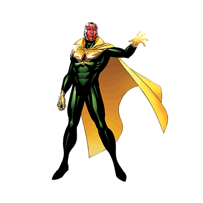
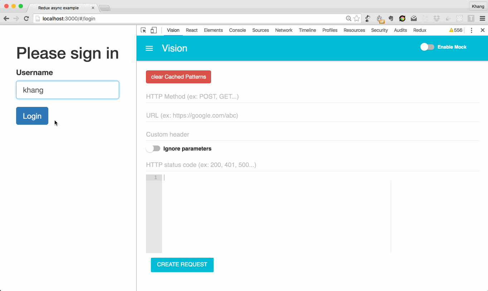

# Vision

####Hi there, I'm The Vision, the Chrome extension that helps you to mock the XHR request on the fly.

## How do I work?

## Installation
Coming really soon

## Architecture
Coming soon

## Improvements
Coming soon

## Contribute
Coming soon

##Q&A
**Why did I use gulp with webpack? why don't use webpack alone (webpack-dev-server)?**

I haven't figure out how to load an chrome extension with a url (because using webpack-dev-derver, the endpoint will be http://localhost:8080) instead of a folder

## Credit
Coming soon
